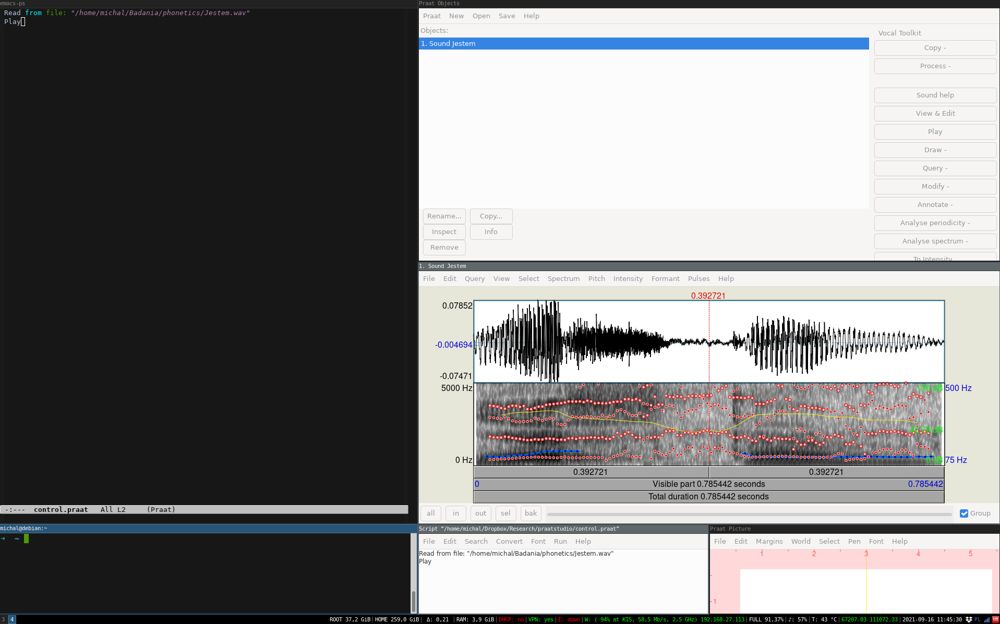
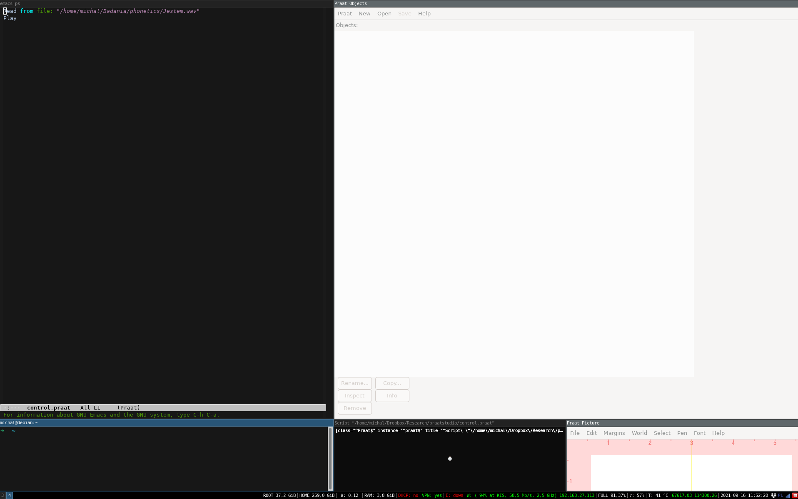

# PraatStudio

1. Instalacja programów składających się na PraatStudio. Wszystkie pogramy można
zainstalować z konsoli za pomocą komendy: `sudo apt get install i3-wm praat
emacs r-base r-base-core r-recommended ess sox`

   * i3-wm: https://i3wm.org/
   * PRAAT: https://www.fon.hum.uva.nl/praat/
   * Emacs: https://www.gnu.org/software/emacs/
   * R: https://cran.r-project.org/ 
   * ESS: https://ess.r-project.org/
   * SoX: http://sox.sourceforge.net/

2. Konfiguracja menadżera okien i3-wm
   * Konfiguracja ułożenia okien za pomocą pliku _workspace-ps.json_:
	 do uzyskania tego pliku należy ręcznie podzielić okna i następnie
	 zapisać uzyskaną konfiguracje do pliku za pomocą komendy
	 `i3-save-tree > workspace-ps.json`
	 
   * Za pomocą programu _xprop_ można sprawdzić własności okien, aby odpowiednio
	 zmodyfikować konfiguracje w pliku _workspace-ps.json_
	 
   * Napisanie skryptu uruchamiającego poszczególne programy, które mają znaleźć
     się w odpowiednich oknach, określonych w pliku workspace-ps.json

   * Stworzenie skrótu klawiszowego uruchamiającego PraatStudio: dodanie do
	 pliku config znajdującego się w folderze ~/.config/i3 linii `bindsym $mod+p exec
	 $HOME/Dropbox/Research/praatstudio/ps_workspace.sh`

3. Konfiguracja środowiska programistycznego R
   * Instalacja pakietów:
	 * rPraat: https://cran.r-project.org/web/packages/rPraat/index.html
	 * tidyverse: https://cran.r-project.org/web/packages/tidyverse/index.html

4. Uruchomienie PraatStudio
   * Po naciśnięciu skrótu klawiszowego w przestrzeni roboczej 4, uruchomi się
     PraatStudio (numer przestrzeni roboczej możemy zmienić w pliku
     _ps_workspace.sh_) 
   * Do ustawienia komunikacji pomiędzy Emacs a PRAAT, wybieramy z menu _Praat
     -> Open Praat script.._ plik _control.praat_. Komunikacja polega na tym, że
     gdy plik jest modyfikowany za pomocą Emacs to w oknie skryptowym PRAAT
     aktualizujemy jego treść _File -> Reopen form disk_ i uruchamiamy: _Run ->
     Run_
 
